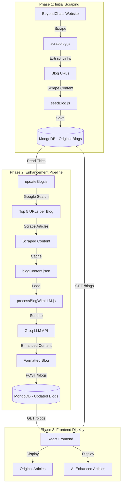

# BeyondChats Blog Platform

A full-stack blog platform that scrapes, processes, and enhances blog content using AI (LLM). Built with React, Express, and MongoDB.

## Project Structure

```
BeyondChats/
├── backend/                 # Express.js API Server
│   ├── src/
│   │   ├── config/          # Database configuration
│   │   ├── controller/      # API route handlers
│   │   ├── model/           # MongoDB schemas
│   │   ├── routes/          # API routes
│   │   ├── utility/         # Scraping & LLM scripts
│   │   └── index.js         # Server entry point
│   └── cache/               # Cached scraped content
├── frontend/                # React + Vite Frontend
│   └── src/
│       ├── component/       # Reusable components
│       └── pages/           # Page components
└── README.md
```

---

## Environment Setup

### Backend `.env`
```env
MONGO_URI=your_mongodb_connection_string
GROQ_KEY=your_groq_api_key
CLIENT_URL=http://localhost:5173
PORT=5000
```

### Frontend `.env`
```env
VITE_BACKEND_URL=http://localhost:5000
```

---

## Quick Start

### 1. Install Dependencies
```bash
# Backend
cd backend && npm install

# Frontend
cd frontend && npm install
```

### 2. Start Servers
```bash
# Backend (Terminal 1)
cd backend && npm run dev

# Frontend (Terminal 2)
cd frontend && npm run dev
```

### 3. Run Complete Pipeline (Seed + Scrape + LLM)
```bash
cd backend
node src/utility/runAllPhases.js
```

---

## Data Flow Architecture



---

##  Backend Scripts

| Script | Description |
|--------|-------------|
| `npm run dev` | Start dev server with nodemon |
| `npm start` | Start production server |
| `node src/utility/runAllPhases.js` | Run complete pipeline |
| `node src/utility/seedBlog.js` | Phase 1: Scrape initial blogs |
| `node src/utility/updateBlog.js` | Phase 2 (1-3): Google search & scrape |
| `node src/utility/processBlogWithLLM.js` | Phase 2 (4-5): LLM processing |

---

## API Endpoints

| Method | Endpoint | Description |
|--------|----------|-------------|
| `GET` | `/blogs` | Get all blogs |
| `GET` | `/blogs/:id` | Get single blog by ID |
| `POST` | `/blogs` | Create new blog |

---

## Tech Stack

**Backend:** Node.js, Express, MongoDB, Mongoose, Cheerio, Groq API  
**Frontend:** React 19, Vite, Tailwind CSS v4, React Router  
**AI:** Groq API with LLaMA 3.3 70B

---

## License

MIT License - See [LICENSE](LICENSE) for details.
